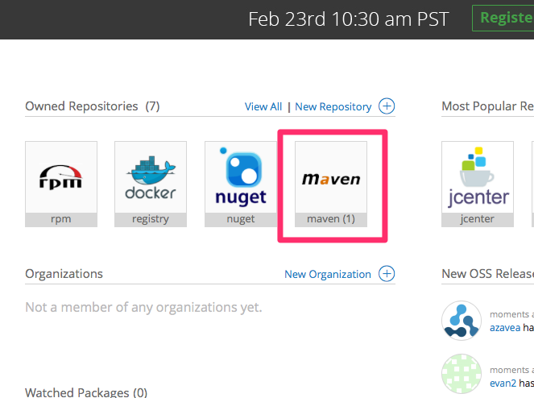
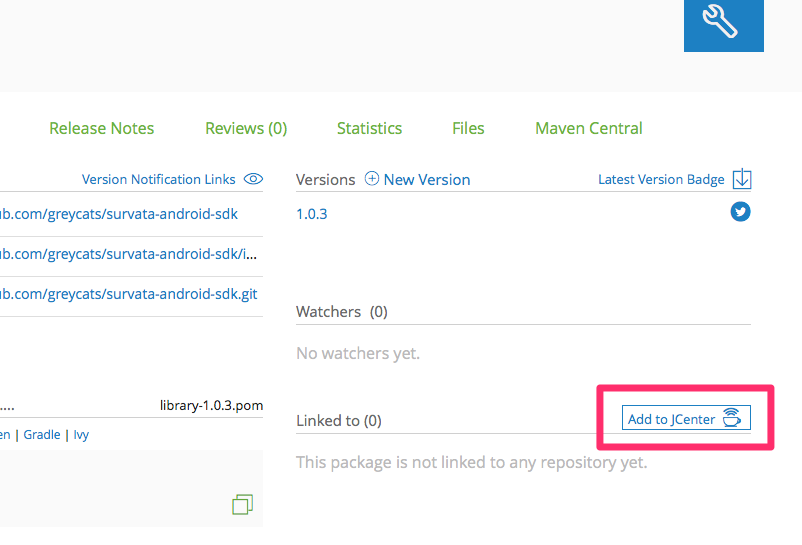
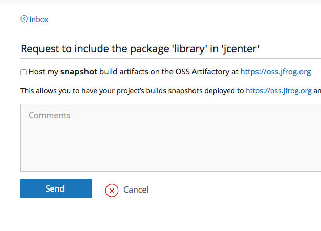

Survata Android SDK
====================

# Requirements #

- Android 4.0 (API Version 14) and up
- android-support-v4.jar, r23 (Updated in 1.0.5)
- android-support-annotations.jar, r23 (Updated in 1.0.5)
- Volley Library (library-1.0.19.jar)(Updated in 1.0.5)

# How to create aar and upload to jcenter #

1.  Register for an account on bintray.com

2.  Package aar and upload

    [bintray-release](https://github.com/novoda/bintray-release), it's provide a super duper easy way to release your Android and other artifacts to bintray.
    
    Refer the steps in [README.md](https://github.com/novoda/bintray-release/blob/master/README.md). 
    
    * modify `publish` closure in `build.gradle`
    
    ```groovy
         publish {
             userOrg = ''
             groupId = ''
             artifactId = ''
             publishVersion = ''
             desc = ''
             website = ''
         }
    ```
    
    * use the task `bintrayUpload` to publish (make sure you build the project first!):
    
    ```bash
    $ ./gradlew clean build bintrayUpload -PbintrayUser=BINTRAY_USERNAME -PbintrayKey=BINTRAY_KEY -PdryRun=false
    ```

3.  Sync bintray user repository to jcenter

    * You now have your own Maven Repository on Bintray which is ready to be uploaded the library to.
    
    [](https://github.com/greycats/survata-android-sdk/blob/development/step1.png)


    * Nothing to do but click Send
    
    [](https://github.com/greycats/survata-android-sdk/blob/development/step2.png)


    * It is pretty easy to sync your library to jcenter. Just go to the web interface and simply click at "Add to JCenter".
    Nothing we can do now but wait for 2-3 hours to let bintray team approves our request. Once sync request is approved, you will receive an email informing you the change. 
    
    [](https://github.com/greycats/survata-android-sdk/blob/development/step3.png)

# Usage #

    Please check out [demo app](https://github.com/greycats/survata-android-demo) for a real-life demo.

### Step 1

Add dependencies in `build.gradle`.

    ```groovy
        dependencies {
            compile 'com.survata.android:library:1.0.7'
        }
    ```
### Step 2

Add permission in `AndroidManifest.xml`

    ```
        <uses-permission android:name="android.permission.INTERNET"/>
        <uses-permission android:name="android.permission.ACCESS_NETWORK_STATE"/>
        
        // optional, if you want to send zipcode
        <uses-permission android:name="android.permission.ACCESS_COARSE_LOCATION" />
        <uses-permission android:name="android.permission.ACCESS_FINE_LOCATION" />
    ```
    

### Step 3

Define Survey

    ```java
    private Survey mSurvey;
    
    private Button mSurveyButton;
    
    ...
    
    ```

### Step 4

Check survey availability. The publisherId is `@NonNull`.

    ```java
     public void checkSurvey() {
            Context context = getContext();
            SurveyOption option = new SurveyOption(publisherId);
            mSurvey = new Survey(option);
            mSurvey.create(getActivity(),
                    new Survey.SurveyAvailabilityListener() {
                        @Override
                        public void onSurveyAvailable(Survey.SurveyAvailability surveyAvailability) {
                            if (surveyAvailability == Survey.SurveyAvailability.AVAILABILITY) {
                                mSurveyButton.setVisibility(View.VISIBLE);
                            }
                        }
                    });
        }
     ```

### Step 5  

show survey in WebView. Should called after checkSurvey();
It will return survey event(COMPLETED, SKIPPED, CANCELED, CREDIT_EARNED, NETWORK_NOT_AVAILABLE)
     
     ```java
     private void showSurvey() {                
            mSurvey.createSurveyWall(getActivity(), new Survey.SurveyStatusListener() {
                    @Override
                    public void onResult(Survey.SurveyEvents surveyEvents) {
                        if (surveyEvents == Survey.SurveyEvents.COMPLETED) {
                              mSurveyButton.setVisibility(View.GONE);
                        }
                    }
                });
            }
    ```